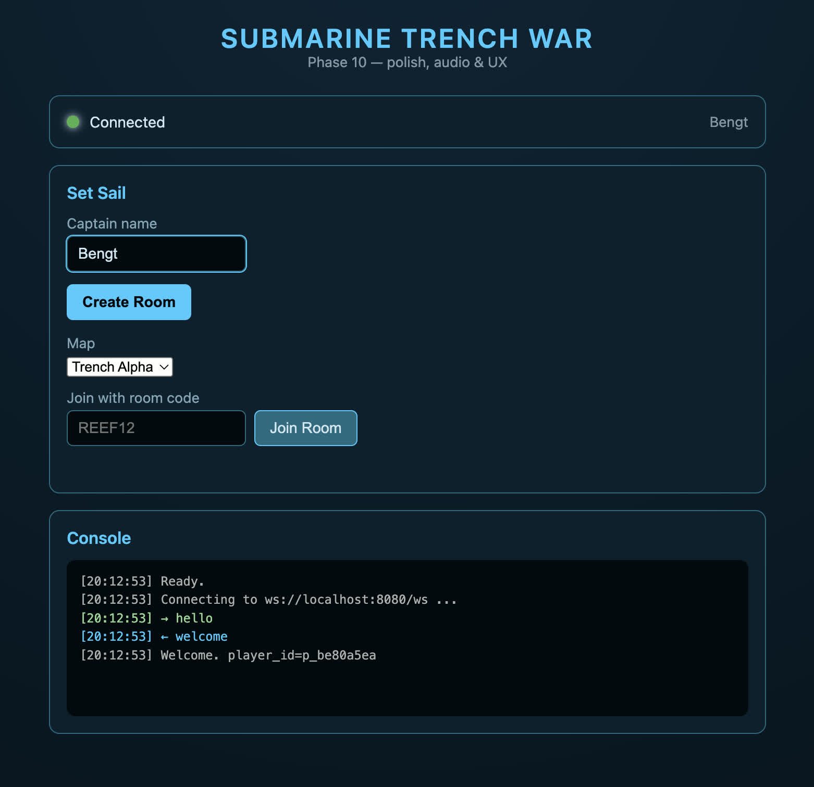
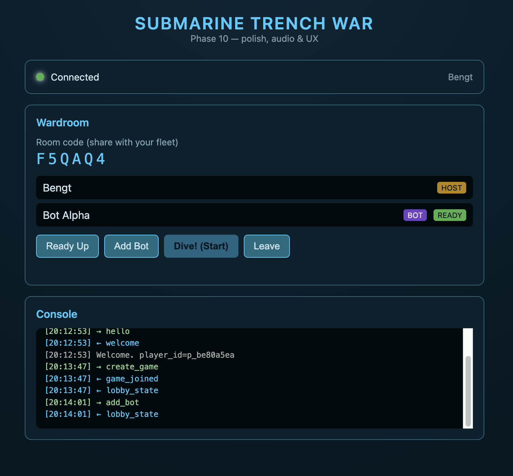
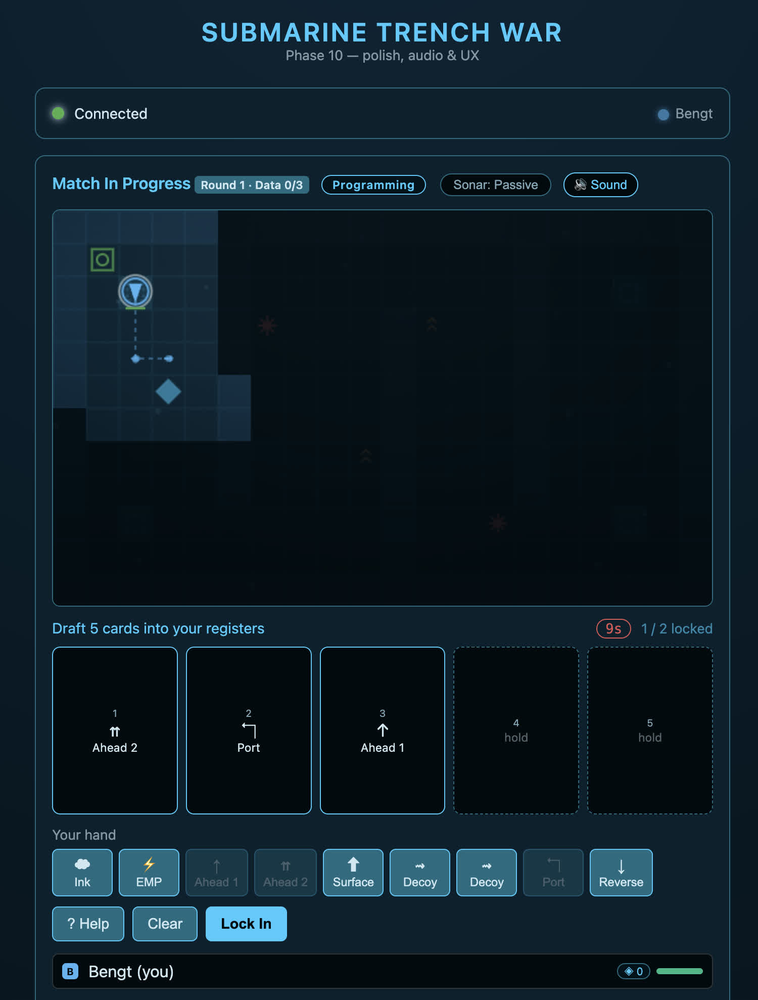

# Submarine Trench War

This is a turn-based multiplayer submarine game. Each round, plan up to five actions in secret. Lock your plan. Then all submarines act at once.

The board is a grid of tiles. A tile is one square. Sonar shows nearby tiles and submarines.

## Screenshots

<a href="screenshots/start.jpeg"></a>
<a href="screenshots/create-room-with-bot.jpeg"></a>
<a href="screenshots/playing.jpeg"></a>

## Quick start

To run the server directly on your computer, install [Erlang/OTP 28 or newer](https://www.erlang.org/downloads) and [rebar3 3.24 or newer](https://rebar3.org/docs/getting-started/). Clone this repository or download its source. From the project directory, run this command to fetch the Cowboy dependency and compile the server:

```sh
rebar3 compile
```

Start the server:

```sh
rebar3 shell
```

Open [http://localhost:8080](http://localhost:8080) in a browser. Stop the server by pressing Ctrl+C twice in the terminal.

You can also run the server in a container. Install Podman or Docker to use this route. The Makefile uses Podman by default. The run command publishes port `8080` on your computer to port `8080` in the container:

```sh
make container-build
make container-run
```

To use Docker, add `CONTAINER=docker` to each command:

```sh
make container-build CONTAINER=docker
make container-run CONTAINER=docker
```

Stop the container by pressing Ctrl+C in the terminal.

## Start a match

Open the game after the server starts. The default address is `http://localhost:8080`.

A bot is a computer-controlled player.

1. Enter a name.
2. If you host, create a room. When you create it, choose a map. Share its code.
3. If you join, enter the code from the host.
4. Select Ready Up. If you host and want bots, add them to open seats. If you host, select Start.
5. Each round, place your cards. Then select Lock In.

Each match has two to four players. You can play alone with bots.

Your browser saves your name and session. If you reload the page or lose the connection, the browser reconnects you.

## A round

Each round has five registers. A register is one ordered action slot.

1. Draw a hand. A hand is the set of cards you can use this round. Every hand includes at least one Ahead card and at least one Port or Starboard Bank card.
2. Place up to five cards in the registers, in the order you want to use them. The dotted path shows your planned route. It does not include actions by other submarines.
3. Select Lock In to submit your plan. When the first player locks, a 30-second timer starts for the other players. If the timer ends, the game fills empty registers with random cards.
4. The game resolves each register. All submarines act at the same time. The game then resolves collisions, weapons, currents, and hazards.
5. Watch the game replay the round with movement and combat animations.

You can select Lock In without cards to pass. Hull is the health of your submarine. Hull damage reduces the size of your next hand. Your hand has at least five cards.

## Cards

Navigation cards move or turn your submarine. Tactical cards attack enemies or change what they can see.

### Navigation cards

| Card | Effect |
| --- | --- |
| Ahead Standard | Move forward one tile. |
| Ahead Flank | Move forward two tiles. |
| Reverse | Move backward one tile without turning. |
| Port Bank | Turn 90 degrees left without moving. |
| Starboard Bank | Turn 90 degrees right without moving. |
| Dive | Move to the Deep layer. |
| Surface | Move to the Shallow layer. |

### Tactical cards

| Card | Effect |
| --- | --- |
| Torpedo | Fire forward. It deals 2 damage to enemies at your depth. A wall stops it. |
| Depth Charge | Place a charge on your tile. It explodes on the next register. It deals 3 damage at any depth. |
| Sonar Ping | Fire forward. It deals 1 damage at any depth. A hit reveals the cards that the target submarine plans to use this round. |
| Ink Cloud | Release ink on your tile. It blocks vision through that tile for two rounds. |
| Decoy | Fire a false torpedo signal. It makes enemy sonar show a false submarine ahead next round. |
| EMP | If an enemy is next to you, EMP replaces its next card with a drift. A drift is an action that does nothing. |

Navigation and tactical cards share a deck. Your hand can change each round.

## Depth, vision, and sonar

Submarines move between two depths: Shallow and Deep. Torpedoes hit only targets at the same depth. Depth charges and sonar pings can hit targets at either depth. Deep submarines have shorter sonar range. Thermal vents force a Deep submarine to Shallow.

Your submarine sees nearby tiles and more tiles in front of it. A wall blocks vision. Usually, you see enemies only when they are in your view.

- Passive sonar is the default. It shows a smaller area. It does not tell other players your position.
- Active sonar shows a larger area. It tells every player your position. To change modes, select Sonar. The change takes effect at once.
- An ink cloud blocks vision through its tile for two rounds.
- If a Sonar Ping hits an enemy, you see its cards for that round.
- Destroyed players and players who join late can watch the full board.

## Hazards and combat

- A mine explodes when your submarine enters it. It deals 3 damage. It replaces the next card with a drift. The game removes the mine.
- Ramming occurs when two submarines try to enter the same tile. Both take damage and move apart.
- Some tiles have currents. They push submarines at the end of each register. Some tiles also cause turbulence. Turbulence turns a submarine 90 degrees.
- Every few rounds, part of the trench collapses and becomes rock. The collapse does not trap a submarine or block every route.

At zero hull, your submarine becomes a wreck. A wreck blocks the trench but cannot take orders.

## Objective

A data node is a marker that gives your submarine data. Data nodes appear only within sonar range. Stop on a node to collect its data.

Reach the moving extraction zone at Shallow depth with enough data to win. The default requirement is three data nodes. The extraction zone is the tile where a submarine can win the match.

When a submarine has enough data, the game shows its position to all players for one round. If a torpedo hits a submarine that carries data, it drops a data node. Another player can collect the node.

For license terms, read [`LICENSE`](LICENSE).
